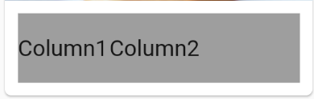

# MINE-Flutter-course


## Widgets

### **Geral**

#### Container

A wrapper component to receive others widgets like columns and rows
```dart
Container(
    padding: EdgeInsets.all(8.0),
    child: Container(
        : Colors.red,
    )
),
```


#### Column
Make a column to receive items in lines, each item is a line
```dart
Column(
    children: <Widget>[
        Text("Line1"),
        Text("Line2"),
    ],
),
```


The follow property say to all child's of Column to try get the max weight that they can
```dart
crossAxisAlignment: CrossAxisAlignment.stretch,
```


#### Row
Make a row to receive items in columns, each item is a column
```dart
Row(
    children: <Widget>[
    Text("Column1"),
    Text("Column2"),
    ],
),
```


#### Flexible & Expanded
They are similar, used to divide the screen by parts similar to flex of css

#### 
Get all max space of his wrapper

```dart
Row(
    children: <Widget>[
        Expanded(
            flex: 2,
            child: Container(
                color: Colors.green,
            ),
        ),
        Expanded(
            flex: 1,
            child: Container(
                color: Colors.yellow,
            ),
        ),
        Expanded(
            flex: 3,
            child: Container(
                color: Colors.red,
            ),
        ),
    ],
),
```


#


### **Media**

#### AspectRatio
To make the aspect ration of the images

```dart
AspectRatio(
    aspectRatio: 1,
    child: Image.network(
        "https://www.generationsforpeace.org/wp-content/uploads/2018/03/empty.jpg",
        fit: BoxFit.cover,
    ),
),
```


```dart
AspectRatio(
    aspectRatio: 0.7,
    child: Image.network(
        "https://www.generationsforpeace.org/wp-content/uploads/2018/03/empty.jpg",
        fit: BoxFit.cover,
    ),
),
```
