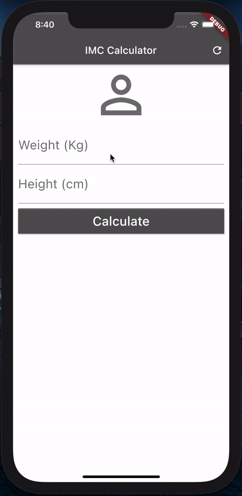

# Flutter Apps

The purpose of this repository is to collect all the applications that results of courses that I make.

#

## Produced Apps

In this section is displayed all apps that where produced.

### App 12 : "Personal Trainer App"

Simple and static app just to test and implement SliverList

| 

#

### App 11 : "TODO App with draggable list"

Simple and static app just to implement a draggable list

| 

#

### App 10 : "Perfect Eggs"

Simple app that use Bloc and Provider to share the state between the Widgets and implements animations (.flr)

|                               Android                               |                               iOS                               |
| :-----------------------------------------------------------------: | :-------------------------------------------------------------: |
|  |  |

#

### App 9 : "IMC App"

Simple app to starting with BLOC

|                            Android                             |                            iOS                             |
| :------------------------------------------------------------: | :--------------------------------------------------------: |
|  |  |

#

### App 8 : "Contact App"

The propose of this app is implement native widgets in each platform

|                            Android                            |                            iOS                            |
| :-----------------------------------------------------------: | :-------------------------------------------------------: |
|  |  |

#

### App 7 : "Shopping App"

Developed with 3 options of theme and some additional animations like on Search bar and open product
White Theme | Dark Green theme | Dark Yellow theme
:-------------------------:|:-------------------------:|:-------------------------:
 |  | 

#

### App 6 : "Contacts App"

With local storage, the user is able to insert, edit and delete his contacts with this application

#

### App 5 : "TODO App"

This application allows local storage, the user is able to insert your TODO task and after mark his TODOss like done or even delete them

#

### App 4 : "FuelOrGas App"

This simple app has some animations and get the values of Fuel and Gas and with the price will tells the best choice

#

### App 3 : "GIPHY App"

The application 3 goes to GIPHY api and get some Gif and allows the user make researches too

#

### App 2 : "CoinConvert App"

Is an application that get by api the coin values and make the conversion between them

#

### App 1 : "IMC App"

This is an app that only make the calculation of the IMC by getting the weight and height by two simple inputs

#

### App 0 : "People Counter App"

The App 0 is tha simplest app that only increments and decrements the number of people.

#
